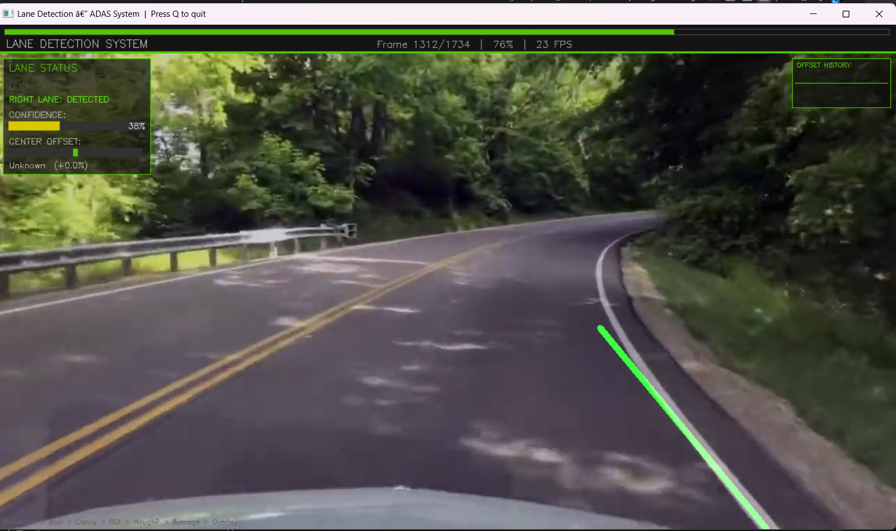
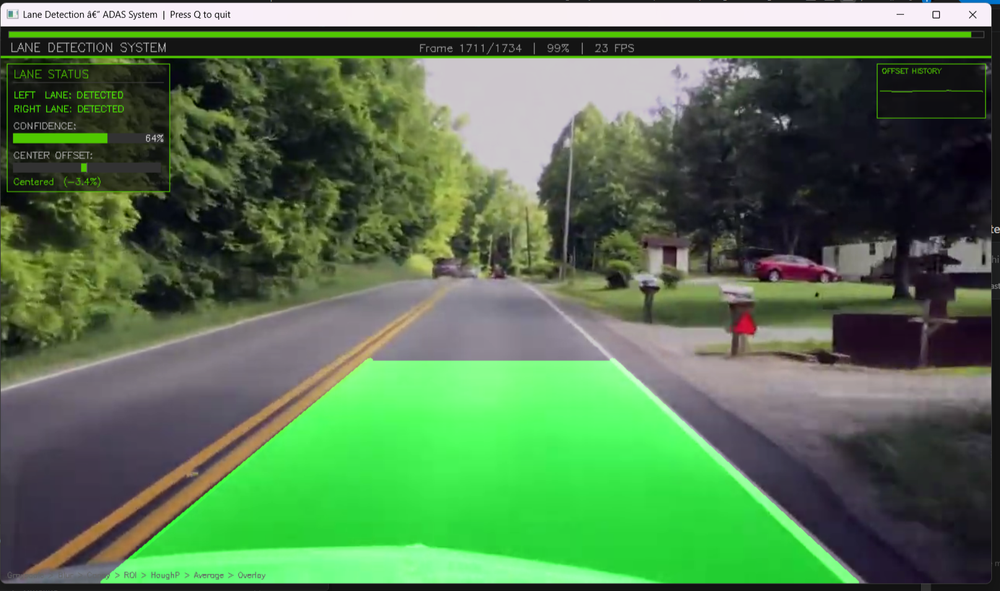

# 🚗 Advanced Lane Detection System (ADAS Edition)

A real-time **Advanced Driver Assistance System (ADAS)** inspired lane detection project built using **Python and OpenCV**.
This system processes dashcam-style driving footage and detects road lane boundaries with an interactive dashboard overlay, confidence scoring, and lane departure warnings.

---

## 👤 Author

**Pranay Gupta**

Registration No: 23BAI11236

VIT Bhopal University

---

## 📸 Output Preview





---

## 🎯 Problem Statement

Lane detection is a critical component of modern **autonomous driving and driver assistance systems**.
The goal of this project is to design a system that can:

* Detect road lane boundaries in real-time
* Estimate vehicle position relative to lane center
* Provide visual feedback and warnings

This project simulates a simplified ADAS pipeline using **classical computer vision techniques**.

---

## 🚀 Key Features (ADAS-Level Enhancements)

* ✅ Real-time lane detection from video input
* ✅ Lane area highlighting (filled polygon)
* ✅ Left & Right lane classification
* ✅ Lane center offset calculation
* ✅ Driving direction detection (Centered / Drifting Left / Right)
* ✅ Confidence scoring system (0–100%)
* ✅ Lane departure warning system
* ✅ Temporal smoothing for stable lane detection
* ✅ Live dashboard overlay with analytics
* ✅ Offset history graph visualization

---

## 🧠 How It Works — Pipeline

Each video frame goes through the following steps:

```
Raw Frame
   │
   ▼
1. Grayscale Conversion       — reduce 3-channel BGR to 1-channel intensity
   │
   ▼
2. Gaussian Blur              — smooth noise to prevent false edge detection
   │
   ▼
3. Canny Edge Detection       — find boundaries using gradient thresholding
   │
   ▼
4. Region of Interest Mask    — isolate the road trapezoid, ignore sky/sides
   │
   ▼
5. Hough Line Transform       — detect straight lines from edge pixels
   │
   ▼
6. Slope Averaging + Filtering — separate left/right lanes and average lines
   │
   ▼
7. Temporal Smoothing         — reduce jitter across frames
   │
   ▼
8. Overlay + Dashboard        — draw lanes, confidence, offset & warnings
```

---

## 📁 Project Structure

```
lane-detection/
│
├── input/
│   └── test_video.mp4              # Input video file
│
├── output/
│   ├── result.mp4                 # Output processed video
│   ├── Lane_Output_1.png          # Output screenshots
│   ├── Lane_Output_2.png
│   ├── Lane_Output_3.png
│   ├── Lane_Output_4.png
│   ├── Terminal_Output_1.png
│   └── Terminal_Output_2.png
│
├── lane_detection.py              # Main script (ADAS pipeline)
├── utils.py                       # All helper + processing functions
├── requirements.txt               # Dependencies
├── README.md                      # Documentation
└── .gitignore
```

---

## ⚙️ Setup & Installation

### Prerequisites

* Python 3.7 or higher
* pip

---

### Step 1: Clone Repository

```bash
git clone https://github.com/YOUR_USERNAME/lane-detection.git
cd lane-detection
```

---

### Step 2: Install Dependencies

```bash
pip install -r requirements.txt
```

---

### Step 3: Add Input Video

Place your video inside:

```
input/test_video.mp4
```

---

## ▶️ Usage

### Run Lane Detection

```bash
python lane_detection.py --input input/test_video.mp4 --output output/result.mp4
```

---

### Run Without Preview (Faster)

```bash
python lane_detection.py --input input/test_video.mp4 --output output/result.mp4 --no-preview
```

---

### Command Options

```
--input  / -i    Path to input video (required)
--output / -o    Path to save output video
--no-preview     Disable live preview window
```

---

## 🔬 Key Concepts Used

| Concept              | OpenCV Function                    | Purpose                              |
| -------------------- | ---------------------------------- | ------------------------------------ |
| Grayscale conversion | `cv2.cvtColor`                     | Reduce channels for processing       |
| Gaussian blur        | `cv2.GaussianBlur`                 | Suppress noise before edge detection |
| Canny edge detection | `cv2.Canny`                        | Detect pixel intensity boundaries    |
| Region of Interest   | `cv2.fillPoly` + `cv2.bitwise_and` | Mask irrelevant parts of frame       |
| Hough Line Transform | `cv2.HoughLinesP`                  | Detect lines from edge pixels        |
| Frame blending       | `cv2.addWeighted`                  | Overlay results on original frame    |
| Morphological op     | `np.polyfit`                       | Smooth/average multiple lane lines   |

---

## ⚠️ Limitations

* Works best on straight or slightly curved roads
* Performance drops in rain, night, or poor lighting
* Cannot handle sharp curves (linear approximation)
* Depends on visible lane markings

---

## 🔮 Future Improvements

* Integration with real-time webcam input
* Deep learning-based lane segmentation (CNN)
* Curved lane detection algorithms
* Multi-lane detection support
* Integration with autonomous driving simulation

---

## 📚 References

* OpenCV Canny Edge Detection docs: https://docs.opencv.org/4.x/da/d22/tutorial_py_canny.html
* OpenCV Hough Lines docs: https://docs.opencv.org/4.x/d9/db0/tutorial_hough_lines.html
* Canny, J.F. (1986). "A Computational Approach to Edge Detection." IEEE

---

## 💡 Final Note

This project demonstrates how powerful **classical computer vision techniques** can be when applied correctly.
It provides a strong foundation for understanding real-world ADAS systems and can be extended into deep learning-based solutions.
